# 零样本目标检测实验报告


---

## 摘要

本报告记录了在GroundingDINO模型基础上完成零样本目标检测任务的探究过程。通过多阶段的探索实验，研究了不同prompt形式对检测效果的影响，尝试了多种改进方案，并对失败案例进行了深入分析。主要发现包括：。最终小幅改进相比实验**prompt1**提升 % mAP。

**关键词**：零样本目标检测、GroundingDINO、Prompt工程

---

## 目录

- [零样本目标检测实验报告](#零样本目标检测实验报告)
  - [摘要](#摘要)
  - [目录](#目录)
  - [一、任务概述](#一任务概述)
    - [1.1 任务背景](#11-任务背景)
    - [1.2 任务目标](#12-任务目标)
  - [二、实验设置](#二实验设置)
    - [2.1 数据集](#21-数据集)
    - [2.2 基线模型](#22-基线模型)
    - [2.3 评估指标](#23-评估指标)
  - [三、单张图片prompt对比+基础调优](#三单张图片prompt对比基础调优)
    - [3.1 模型简介](#31-模型简介)
    - [3.2 具体实现过程](#32-具体实现过程)
  - [四、Prompt工程与对比实验](#四prompt工程与对比实验)
    - [4.1实验概述](#41实验概述)
    - [4.2 实验设置](#42-实验设置)
    - [4.3实验结果和分析](#43实验结果和分析)
      - [4.3.1详细比对核心指标：](#431详细比对核心指标)
      - [4.3.2对比召回率：](#432对比召回率)
      - [4.3.3尺寸敏感性分析：](#433尺寸敏感性分析)
  - [五、小幅改进方向A——多提示集成与NMS后处理在零样本目标检测中的改进](#五小幅改进方向a多提示集成与nms后处理在零样本目标检测中的改进)
    - [5.1多提示集成的动机](#51多提示集成的动机)
    - [5.2改进策略演进](#52改进策略演进)
    - [5.3结果与分析](#53结果与分析)
  - [六、小幅改进方向C——自适应阈值策略在零样本目标检测中的探索与反思](#六小幅改进方向c自适应阈值策略在零样本目标检测中的探索与反思)
    - [6.1改进动机](#61改进动机)
    - [6.2第一次尝试：基于已过滤结果的阈值统计](#62第一次尝试基于已过滤结果的阈值统计)
      - [6.2.1思路](#621思路)
      - [6.2.2实现步骤](#622实现步骤)
      - [6.2.3失败原因分析](#623失败原因分析)
    - [6.3第二次尝试：基于验证集的动态阈值策略](#63第二次尝试基于验证集的动态阈值策略)
      - [6.3.1实验设计](#631实验设计)
      - [6.3.2结果分析](#632结果分析)
    - [6.4经验教训与反思](#64经验教训与反思)
  - [七、结论与讨论](#七结论与讨论)
    - [7.1主要结论](#71主要结论)
    - [7.2本实验研究的局限性](#72本实验研究的局限性)
    - [7.3未来工作方向](#73未来工作方向)


---

## 一、任务概述

### 1.1 任务背景
零样本目标检测旨在检测训练阶段未见过的类别，是计算机视觉领域的重要研究方向。

### 1.2 任务目标
1. 选择并复现基线模型（GroundingDINO）
2. 在COCO数据集上构建 65 seen / 15 unseen 划分
3. 对比不同prompt形式对检测效果的影响
4. 实现一个改进点并验证有效性
5. 分析失败案例


---

## 二、实验设置

### 2.1 数据集
- **数据集**：MS COCO 2017
- **划分方式**：65 seen / 15 unseen
- **seen类（65类）**：`person, bicycle, car, motorcycle, airplane, bus, train, truck, boat, traffic light, fire hydrant, stop sign, parking meter, bench, bird, cat, dog, horse, sheep, cow, elephant, bear, zebra, giraffe, backpack, umbrella, handbag, tie, suitcase, frisbee, skis, snowboard, sports ball, kite, baseball bat, baseball glove, skateboard, surfboard, tennis racket, bottle, wine glass, cup, fork, knife, spoon, bowl, chair, couch, potted plant, bed, dining table, toilet, tv, laptop, mouse, remote, keyboard, cell phone, microwave, oven, toaster, scissors, teddy bear, hair drier, toothbrush`
- 
- **Unseen类（15类）**：`banana, apple, sandwich, orange, broccoli, carrot, hot dog, pizza, donut, cake, sink, refrigerator, book, clock, vase`

### 2.2 基线模型
- **模型**：GroundingDINO_SwinB
- **预训练权重**：groundingdino_swinb_cogcoor.pth
- **默认阈值**：0.25
- **推理设备**：cpu

### 2.3 评估指标
- **mAP**：平均精度（IoU=0.5:0.95）
- **AP50**：IoU=0.5时的精度
- **召回率**：unseen类的检测召回率

---

## 三、单张图片prompt对比+基础调优

### 3.1 模型简介
GroundingDINO是一种基于Transformer的文本引导检测模型，通过将文本提示与图像特征融合，实现开放词汇目标检测。

### 3.2 具体实现过程
在官方代码的基础上，编写针对单张图片的推理代码：[inference_on_a_image.py](GroundingDINO_main/demo/my_code/inference_on_a_image.py)，输入一张图片：
运行代码指令：
```bash
set PYTHONPATH=D:\groundingdino_work\GroundingDINO-main;%PYTHONPATH% 
&& python D:\groundingdino_work\GroundingDINO-main\demo\inference_on_a_image.py 
--config D:\groundingdino_work\GroundingDINO-main\groundingdino\config\GroundingDINO_SwinB_cfg.py 
--checkpoint D:\groundingdino_work\GroundingDINO-main\weights\groundingdino_swinb_cogcoor.pth 
--image_path D:\groundingdino_test\test.png 
--text_prompt "cat" 
--output_dir D:\groundingdino_test\output
```
得到结果：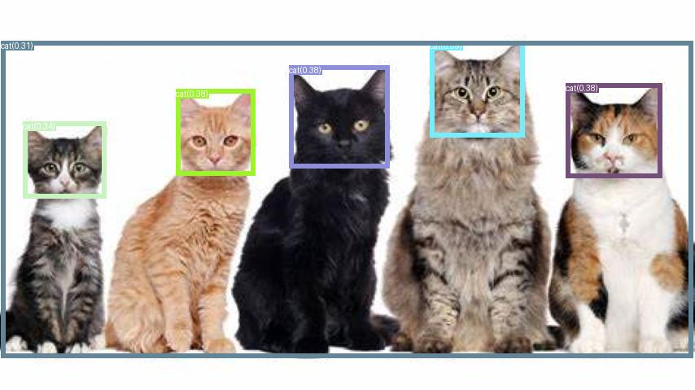
**说明模型可以正常运行，cat检测良好，置信度、检测框等都没有大问题**

第二步，测试精细描述"black cat"：
```bash
set PYTHONPATH=D:\groundingdino_work\GroundingDINO-main;%PYTHONPATH% 
&& python D:\groundingdino_work\GroundingDINO-main\demo\inference_on_a_image.py 
--config D:\groundingdino_work\GroundingDINO-main\groundingdino\config\GroundingDINO_SwinB_cfg.py 
--checkpoint D:\groundingdino_work\GroundingDINO-main\weights\groundingdino_swinb_cogcoor.pth 
--image_path D:\groundingdino_test\test.png 
--text_prompt "black cat" 
--output_dir D:\groundingdino_test\output
```
得到结果：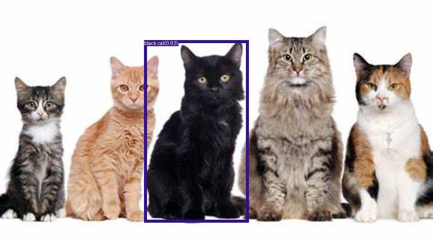
**说明模型可以理解精细描述，将黑猫和别的猫进行区分**

第三步，测试完整句子--"a cat sitting on the floor"：
```bash
set PYTHONPATH=D:\groundingdino_work\GroundingDINO-main;%PYTHONPATH% 
&& python D:\groundingdino_work\GroundingDINO-main\demo\inference_on_a_image.py 
--config D:\groundingdino_work\GroundingDINO-main\groundingdino\config\GroundingDINO_SwinB_cfg.py 
--checkpoint D:\groundingdino_work\GroundingDINO-main\weights\groundingdino_swinb_cogcoor.pth 
--image_path D:\groundingdino_test\test.png 
--text_prompt "a cat sitting on the floor" 
--output_dir D:\groundingdino_test\output
```
得到结果：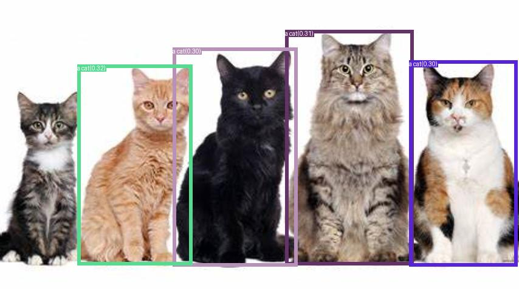
**说明模型可以理解长句子，但检测出的目标并不全面（漏检一只）**

因此需要修改模型的两个参数： box_threshold 和 text_threshold

- box_threshold（默认 0.3）：控制检测框的置信度。

  调大（如 0.5）：去掉低置信度的误检框

  调小（如 0.2）：找回漏检的框
- text_threshold（默认 0.25）：控制文本和框的匹配度。

  调大（如 0.4）：只有文本匹配度高的框才保留

  调小（如 0.2）：匹配度低的也保留

第四步，修改参数 box_threshold = 0.2  ； text_threshold = 0.2：
```bash
set PYTHONPATH=D:\groundingdino_work\GroundingDINO-main;%PYTHONPATH% 
&& python D:\groundingdino_work\GroundingDINO-main\demo\inference_on_a_image.py 
--config D:\groundingdino_work\GroundingDINO-main\groundingdino\config\GroundingDINO_SwinB_cfg.py 
--checkpoint D:\groundingdino_work\GroundingDINO-main\weights\groundingdino_swinb_cogcoor.pth 
--image_path D:\groundingdino_test\test.png 
--text_prompt "a cat sitting on the floor" 
--output_dir D:\groundingdino_test\output 
--box_threshold 0.2 
--text_threshold 0.2
```
得到结果：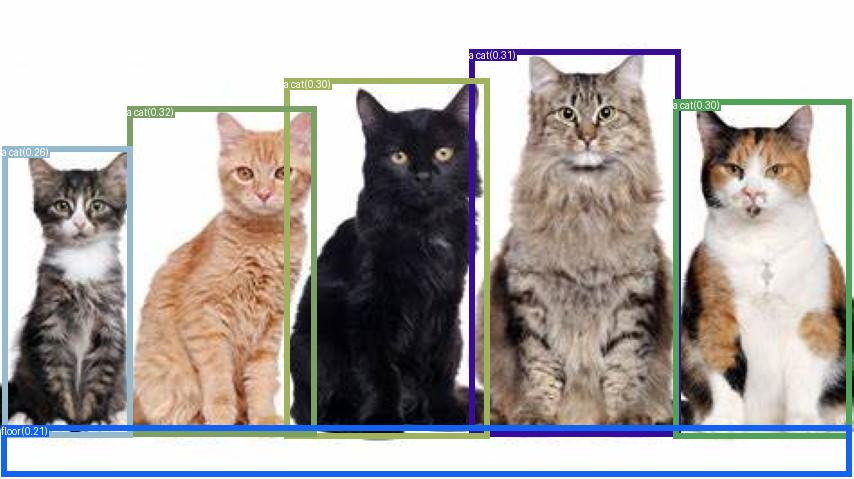
**降低置信度和匹配度，找回漏检，但出现了误检**

第五步，修改参数 box_threshold = 0.3  ； text_threshold = 0.2 ，得到结果：
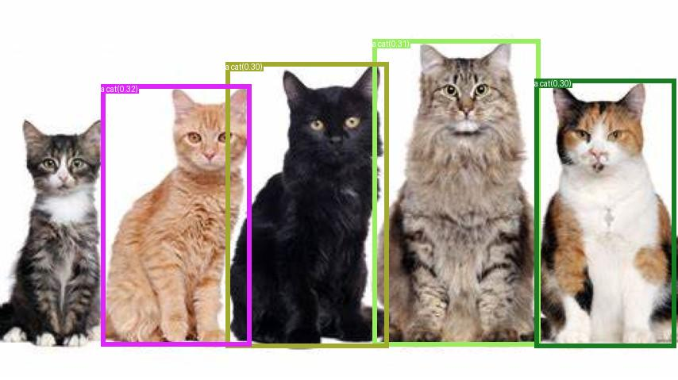
**提升置信度，匹配度不变，出现漏检，误检消失，结果同pred2**

第六步，修改参数 box_threshold = 0.2  ； text_threshold = 0.3 ，得到结果：
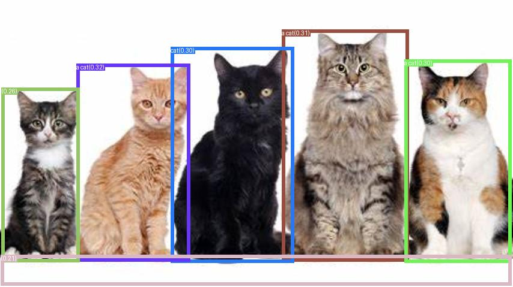
**恢复置信度，提高匹配度，找回漏检，出现误检，结果同pred3**

第七步，修改参数 box_threshold = 0.2  ； text_threshold = 0.25 ，得到结果：
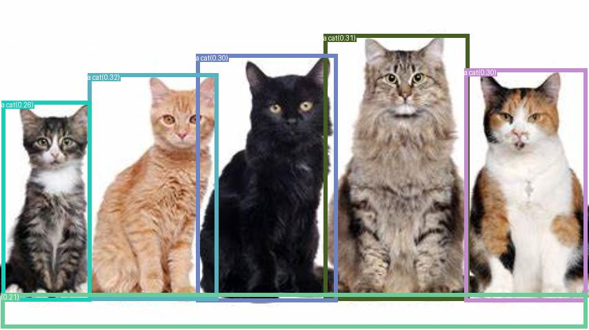
**置信度不变，降低匹配度，找回漏检，出现误检，结果同pred5**

第八步，修改参数 box_threshold = 0.25  ； text_threshold = 0.25 ，得到结果：
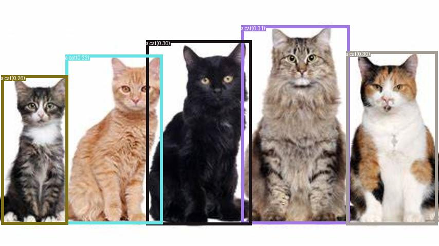
**提高置信度，匹配度不变，找回漏检，误检消失，结果没有问题，参数合理**

在改进过程中：**调试参数过程中发现，0.01的变化对结果没有很大影响，故调节过程应该以0.05为步长，且两个参数均调整时结果改变明显。**

---
## 四、Prompt工程与对比实验

### 4.1实验概述
本实验旨在探究不同形式的文本提示（Prompt）对零样本目标检测性能的影响。实验采用 GroundingDINO 作为基线模型，在 COCO2017 验证集上进行评测。编写了三类prompt的推理脚本：[inference_coco.py](GroundingDINO_main/demo/my_code/inference_coco.py) 和对应的评测脚本：[eval_coco.py](GroundingDINO_main/demo/my_code/eval_coco.py) 。最终得到实验结果并进行比对分析。

### 4.2 实验设置
- prompt1：纯类名，直接使用类别名称，例如"cat"
- prompt2：模板句，使用固定模板，例如"a photo of a cat"
- prompt3：细粒度描述，添加属性描述，例如"black cat"
- 推理脚本分别推理得到：SEEN类别（65类）的检测结果 + UNSEEN类别（15类）的检测结果 。目的是：在SEEN类上评估模型在**已知类别**上的表现，在UNSEEN类上评估模型在**未知类别**上的零样本检测能力。对比两者，就可以了解模型的泛化能力。


### 4.3实验结果和分析
运行推理脚本后分别得到了三次推理结果文件：

- prompt1推理结果文件：[coco_seen_400imgs_prompt1.json](GroundingDINO_main/results/results_prompt_experiment/coco_seen_400imgs_prompt1.json)、[coco_unseen_100imgs_prompt1.json](GroundingDINO_main/results/results_prompt_experiment/coco_unseen_100imgs_prompt1.json)

- prompt2推理结果文件：[coco_seen_400imgs_prompt2.json](GroundingDINO_main/results/results_prompt_experiment/coco_seen_400imgs_prompt2.json)、[coco_unseen_100imgs_prompt2.json](GroundingDINO_main/results/results_prompt_experiment/coco_unseen_100imgs_prompt2.json)

- prompt3推理结果文件：[coco_seen_400imgs_prompt3.json](GroundingDINO_main/results/results_prompt_experiment/coco_seen_400imgs_prompt3.json)、[coco_unseen_100imgs_prompt3.json](GroundingDINO_main/results/results_prompt_experiment/coco_unseen_100imgs_prompt3.json)

运行推理脚本后得到三次推理结果的文本 + 可视化评测，并进行结果的分析。结果均存放在文件夹`results_prompt_experiment/`中。

#### 4.3.1详细比对核心指标：

| Prompt类型	| SEEN AP@0.5 |	UNSEEN AP@0.5 |	SEEN AP@[0.5:0.95] |	UNSEEN AP@[0.5:0.95]  |
|:-------------:|:-----------:|:-------------:|:-----------------:|:-------------------------:|
|纯类名 (prompt1)      |	0.3443    |     0.1727      |	    0.2860      |     0.1409      |
|模板句 (prompt2)      |	0.2279    |  	0.1585	    |   0.1841          | 	0.1131        |
|细粒度描述 (prompt3)  |    0.3450	   |     0.2047     | 	0.2856          |  	 0.1661        |

三类prompt各自的核心指标的可视化结果：
|Prompt|图片|
|---|---|
|prompt1|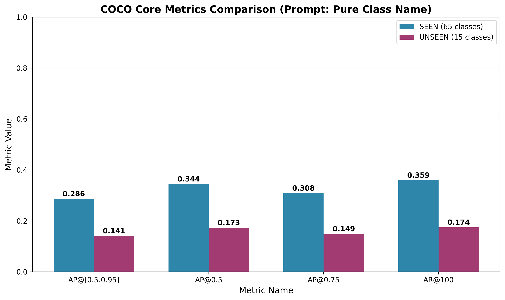|
|prompt2|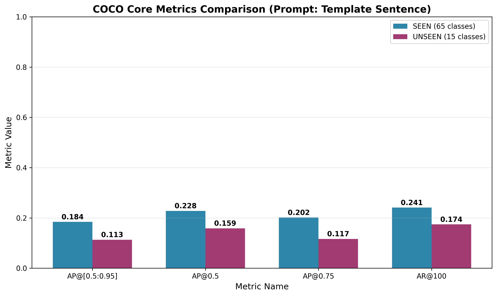|
|prompt3|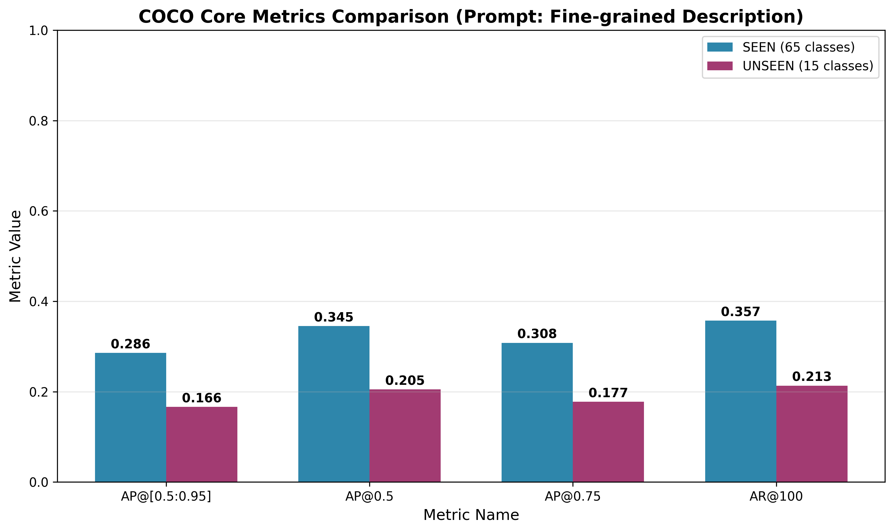|

三类prompt核心指标对比：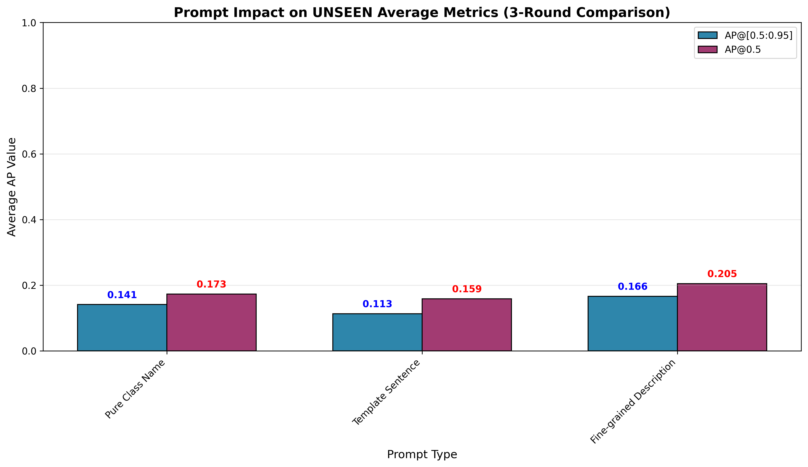

我们可以发现：

- **细粒度描述效果最好**，UNSEEN AP@0.5 :  0.2047（比纯类名提升 18.5%），说明添加属性描述能帮助模型更好地理解未见类别。
- **模板句效果最差**，UNSEEN AP@0.5 仅 0.1585（比纯类名下降 8.2%），推测可能原因是固定的模板过于通用，会引入语言噪声。
- **SEEN类别性能稳定**，纯类名和细粒度描述的SEEN AP@0.5相近（~0.344）。

#### 4.3.2对比召回率：
|Prompt类型|	UNSEEN AR@100|	SEEN AR@100|差距|
|---|---|---|---|
|纯类名|	0.1742|	0.3590|0.1848|
|模板句|	0.1740|	0.2410|0.0670|
|细粒度描述|	0.2132|	0.3572|0.1440|

三类prompt各自的召回率可视化结果：
|Prompt|图片|
|---|---|
|prompt1|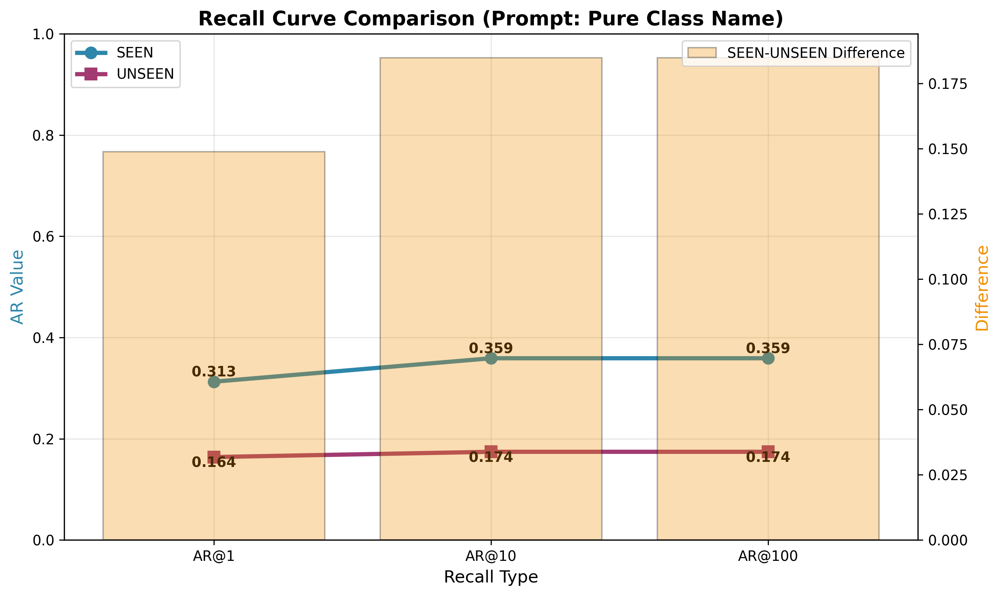|
|prompt2|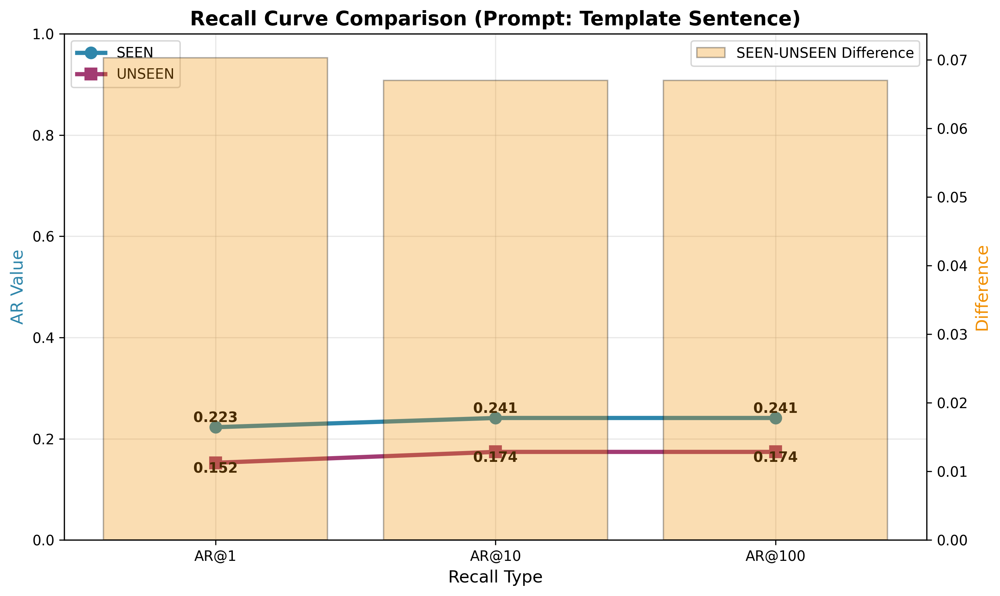|
|prompt3|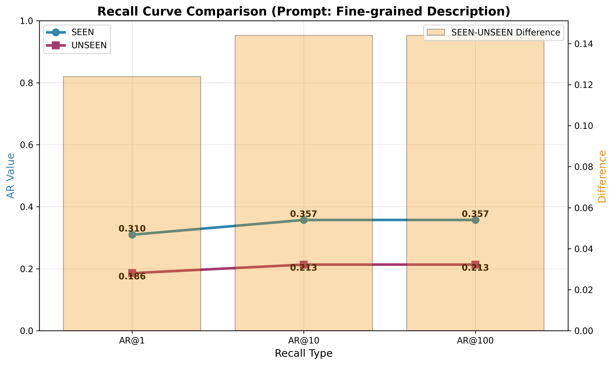|

我们可以发现：
- **细粒度描述对UNSEEN召回率提升最大**，UNSEEN AR@100从0.1742 → 0.2132（提升22.4%），说明详细的属性描述帮助模型发现更多未见过的物体。
- **模板句严重损害SEEN召回率**，SEEN AR@100从0.3590暴跌至0.2410（下降32.9%），固定模板对已知类别产生了负面干扰。
- SEEN 和 UNSEEN召回率差距变化，纯类名差距0.1848（SEEN远高于UNSEEN），细粒度描述差距缩小到0.1440，**说明细粒度描述缩小了已知/未知类别间的性能鸿沟**。
- **召回率分析表明，细粒度描述能帮助模型发现更多未见过的物体。**

#### 4.3.3尺寸敏感性分析：
UNSEEN类别尺寸敏感数据
|物体尺寸|	纯类名 (prompt1)|	模板句 (prompt2)|	细粒度描述 (prompt3)|
|---|---|---|---|
|小物体 (AP_small)|	0.0419|	0.0476|	0.0455|
|中物体 (AP_medium)|	0.0971|	0.1159|	0.1222|
|大物体 (AP_large)|	0.2323|	0.1581|	0.2655|

SEEN类别尺寸敏感数据（参考）
|物体尺寸|	纯类名 (prompt1)|	模板句 (prompt2)|	细粒度描述 (prompt3)|
|---|---|---|---|
|小物体 (AP_small)|	0.1127|	0.0594|	0.1137|
|中物体 (AP_medium)|	0.2907|	0.2147|	0.2811|
|大物体 (AP_large)|	0.4887|	0.3504|	0.4956|

三类prompt各自的尺寸敏感性分析可视化结果：
|Prompt|图片|
|---|---|
|prompt1|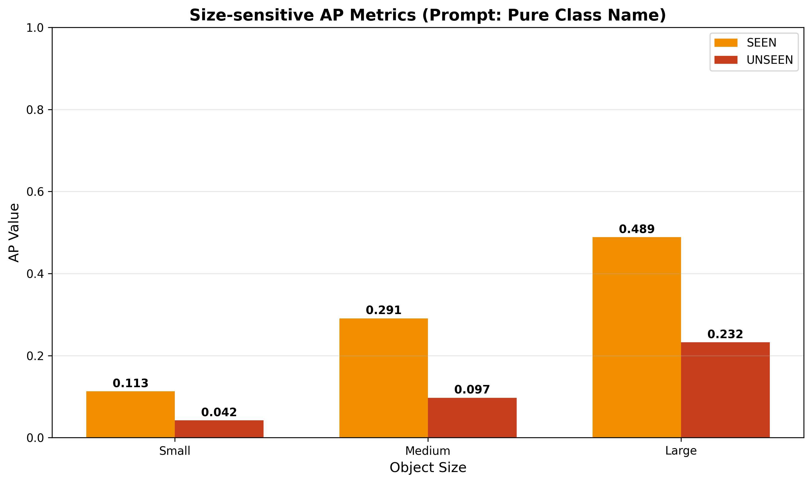|
|prompt2|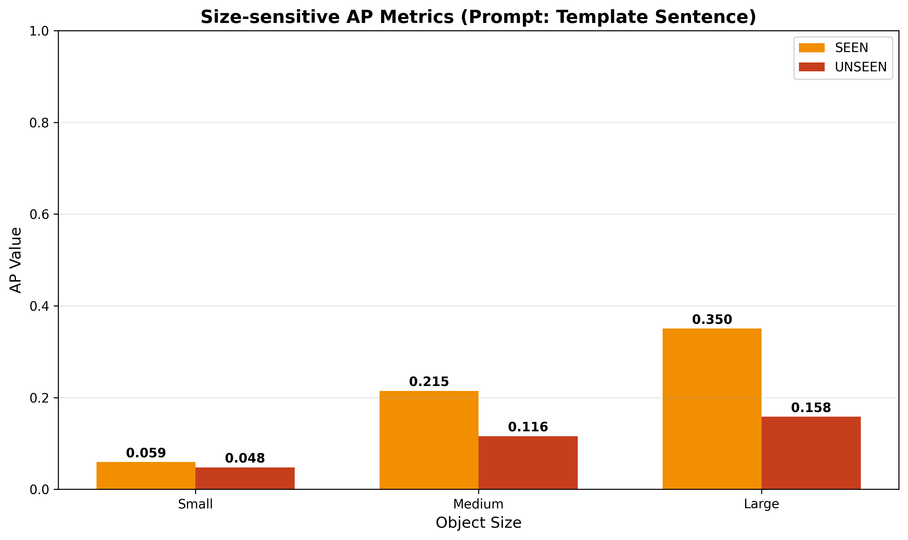|
|prompt3|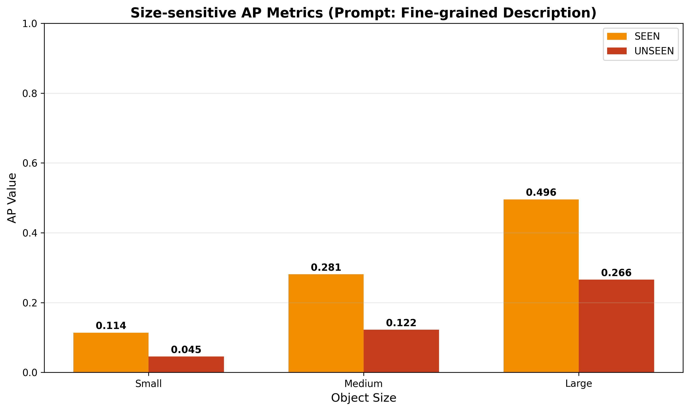|

我们可以发现：
- **尺寸越大，检测效果越好**。UNSEEN大物体 AP=0.2655（是小物体的5.8倍）；UNSEEN中物体 AP=0.1222（是小物体的2.7倍）。说明零样本检测对小物体极度不友好。
- **细粒度描述对大物体提升最明显**。大物体：0.2323 → 0.2655（提升14.3%）；中物体：0.0971 → 0.1222（提升25.9%）；小物体：0.0419 → 0.0455（提升8.6%）。说明属性描述对中大型物体帮助更大。
- **模板句严重损害大物体检测**。大物体：0.2323 → 0.1581（下降31.9%）。说明模板句对大物体的负面影响最大
- **小物体检测是零样本的最大挑战，未来改进方向需要专门针对小物体进行优化！**


## 五、小幅改进方向A——多提示集成与NMS后处理在零样本目标检测中的改进

### 5.1多提示集成的动机
不同形式的文本提示可能激活模型不同的语义理解能力，通过融合三种提示的检测结果，可以取长补短，提高整体性能。

### 5.2改进策略演进
- 阶段1：最大置信度融合

  对同一张图片、同一类别、同一位置（bbox四舍五入到整数）的检测框，从三个prompt的结果中选取置信度最高的框保留。

- 阶段2：引入NMS后处理

  在阶段1的基础上，对融合结果按图片和类别分组，应用非极大值抑制（NMS，IOU阈值=0.5），去除因位置轻微偏移产生的冗余框。
所有代码文件均在`my_code/improved_A/`中。

### 5.3结果与分析
改进后运行推理脚本得到的推理结果（文本 + 可视化结果）均存放在文件夹`results_improved_A/`中。

最大置信度融合后：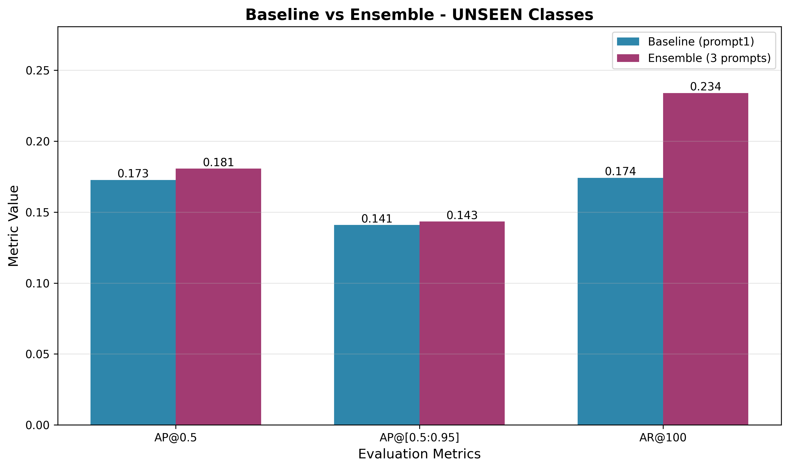

加入NMS处理后：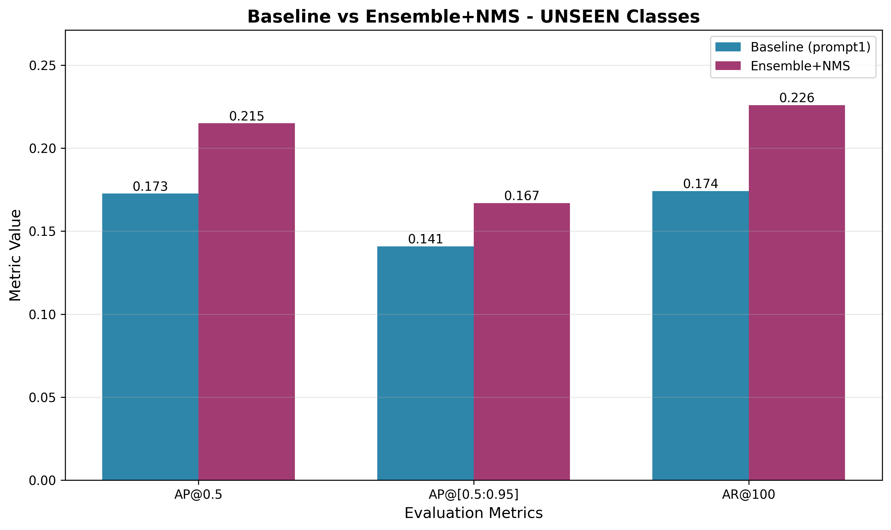

各阶段性能对比：
|指标|	基线 (prompt1)|	阶段1: 最大置信度融合|	阶段2: +NMS|
|---|---|---|---|
|AP@0.5|	0.1727|	0.1806 (+4.6%)|	0.2150 (+24.5%)|
|AP@[0.5:0.95]|	0.1409|	0.1434 (+1.8%)|	0.1670 (+18.5%)|
|AR@100|	0.1742|	0.2340 (+34.3%)|	0.2260 (+29.7%)|

阶段贡献分解：
|阶段|	策略|	AP@0.5贡献|	AR@100贡献|	作用|
|---|---|---|---|---|
|阶段1|	最大置信度融合|	+0.0079 (4.6%)|	+0.0598 (34.3%)|	提高召回率|
|阶段2|	+NMS|	+0.0344 (19.0%)|	-0.0080 (-3.4%)|	提高精度|
|整体|	两者结合|	+0.0423 (24.5%)|	+0.0518 (29.7%)|	最佳平衡|

我们发现：
- 阶段1：最大置信度融合

  召回率大幅提升（+34.3%）：说明不同prompt确实检测到了互补的目标，融合后显著增加了正确检测的数量。

  精度小幅提升（+4.6%）：融合时取最高分，自然倾向于选择更准确的框。

- 阶段2：引入NMS

  精度大幅提升（+19.0%）：NMS去除了因位置偏移产生的冗余框，使每个真实物体只计一次，显著提高了精确率。

  召回率略微下降（-3.4%）：极少数情况下，NMS可能误删了轻微偏移但仍是正确的框，但损失可接受。

- 整体效果：最终AP@0.5从0.1727提升至0.2150，相对提升24.5%

**本实验成功验证了多提示集成在零样本目标检测中的有效性**，未来工作可专注于探索动态权重融合（根据类别或场景调整prompt权重）或是尝试WBF（加权框融合）替代NMS，可能进一步提升定位精度。


## 六、小幅改进方向C——自适应阈值策略在零样本目标检测中的探索与反思
第一次尝试结果均保存在文件夹`results/results_prompt_experiment/`中。第二次尝试结果均保存在文件夹`results/results_improved_C/`中。所有代码文件均在`my_code/improved_C/`中。

### 6.1改进动机
不同类别的最优置信度阈值往往不同（例如对于常见类别如person、car等，模型置信度高，可用较高阈值保证精确率；而对于罕见类别如toaster、hair drier等，模型置信度低，需用较低阈值保证召回率），使用统一阈值（0.25）无法平衡所有类别，因此尝试为每个类别设置独立阈值。

### 6.2第一次尝试：基于已过滤结果的阈值统计
#### 6.2.1思路
最初的思路是：从基线推理结果中统计每个类别的最优阈值，然后用这些阈值重新过滤检测结果。

#### 6.2.2实现步骤
1.运行基线推理（阈值0.25），得到结果文件 coco_seen_400imgs_prompt1.json

2.对该结果文件进行阈值扫描，为每个类别找到使F1最高的阈值

3.将统计出的阈值保存，用于改进版推理

#### 6.2.3失败原因分析
|问题|	说明|
|---|---|
|统计对象错误|	统计的是已过滤后的结果，而非模型的原始输出|
|信息丢失|	基线推理时已用0.25阈值过滤，所有<0.25的框已永久丢失|
|闭环陷阱|	在已过滤结果上找最优阈值，只能得到"当前集合的最小值"（0.1），无法带来新框|

**阈值优化的正确对象应该是模型的原始输出，而不是已经过阈值过滤的结果！**

### 6.3第二次尝试：基于验证集的动态阈值策略
#### 6.3.1实验设计
吸取第一次失败的教训，重新设计实验流程：
```bash
Step 1: 从SEEN类别中划分20%作为验证集（948张图片）
Step 2: 用极低阈值(0.01)在验证集上推理，收集所有原始预测结果
Step 3: 基于验证集的真实标注，为每个类别动态选择阈值
   - 最高置信度 > 0.2 → 进行阈值优化
   - 最高置信度 0.1-0.2 → 使用阈值0.1
   - 最高置信度 < 0.1 → 使用默认阈值0.15
   - 框数 < 5 → 使用默认阈值0.15
Step 4: 用优化后的阈值在测试集上进行推理
Step 5: 与基线对比评估
```

#### 6.3.2结果分析
从 [threshold_optimization_report.txt](GroundingDINO_main/results/results_improved_C/threshold_optimization_report.txt) 可以看出:
|类别类型|	类别数|	阈值分布|	典型类别|	验证集AP|
|---|---|---|---|---|
|优化类别|	11个|	0.05-0.09|	motorcycle, traffic light, baseball glove|	多数AP≈0，少数AP≈0.02|
|中等置信度类别|	10个|	0.10|	person, airplane, stop sign|	仅person类AP=0.574，其余AP=0|
|低置信度类别|	44个|	0.15|	其余所有类别|	AP=0|
|无检测框类别|	0个|	-|	-|	-|

只有 person类 (ID:1) 在验证集上有实际检测能力（AP=0.574），其他类别AP几乎为0。

最终性能对比
|指标|	基线|	改进版|	变化|	相对变化|
|---|---|---|---|---|
|AP@0.5|	0.1727|	0.0742|	-0.0985|	↓57%|
|AP@[0.5:0.95]|	0.1409|	0.0568|	-0.0841|	↓60%|
|AR@100|	0.1742|	0.1623|	-0.0119|	↓7%|

可能的失败原因：**验证集与测试集分布不一致**

从验证集上的置信度分布（之前运行的 [check_val_set_confidence.py](GroundingDINO_main/demo/my_code/improved_C/check_val_set_confidence.py)）看出：
- 验证集上person类最高置信度仅0.14，无≥0.2的框。
- 但测试集上person类有大量高置信度框（基线AP=0.1727）。

推测：验证集和测试集的分布存在显著差异，导致在验证集上优化的阈值不适用于测试集。

### 6.4经验教训与反思
- 方法论层面的教训
    - 统计对象必须正确

        - 阈值优化必须基于模型的原始输出，而非已过滤的结果

        - 任何预处理步骤都会丢失信息，而这些信息可能是改进的关键

    - 验证集与测试集分布必须一致

        - 在验证集上优化的参数，只有在分布一致时才适用于测试集

        - 随机划分不能保证分布一致，需要检查置信度分布


- 零样本检测的特有挑战
    - 置信度漂移

        SEEN类别和UNSEEN类别的置信度分布差异大，在SEEN上优化的阈值无法泛化到UNSEEN

    - 正确与误检难以区分

        - UNSEEN类别上，正确框和误检框的置信度重叠严重

        - 阈值调整可能引入更多误检而非正确框

    - 验证集构建困难

        UNSEEN类别在验证集中出现少，难以获得可靠的统计

**自适应阈值策略在本实验设定下未能带来性能提升，反而因引入大量误检导致AP下降57%。未来的工作应考虑更复杂的方法，如基于语义相似度的动态阈值，或将阈值优化与多提示集成结合。**

## 七、结论与讨论
### 7.1主要结论
- Prompt设计显著影响零样本检测性能：细粒度描述效果最佳且缩小了已知/未知类别的性能鸿沟，模板句反而降低性能。

- 检测性能与目标尺寸正相关，小物体检测是零样本检测的最大挑战。

- 多提示集成是有效的改进方向，不同prompt确实检测到了互补的目标。

- 阈值优化必须基于模型的原始输出，而非已过滤的结果。任何预处理都会丢失关键信息。

- 验证集与测试集分布必须一致。本实验中验证集和测试集的置信度分布存在显著差异，导致优化的阈值无法泛化。

### 7.2本实验研究的局限性
- **数据集局限**：仅在COCO 2017数据集上验证，未测试在其他数据集（如LVIS、Objects365）上的泛化能力。

- **计算资源限制**：受限于CPU设备，实验仅使用了400张SEEN图片和100张UNSEEN图片的子集进行评测，可能无法完全反映模型在完整测试集上的表现。

- **细粒度描述依赖人工**：实验中使用的属性描述需要人工设计，难以规模化扩展到更多类别。

- **改进点计算成本**：多提示集成需要运行三次推理，计算成本增加200%，在实际应用中需要考虑效率问题。

### 7.3未来工作方向
- **针对小目标的专门优化**：多尺度特征融合（引入FPN（特征金字塔网络）增强小目标特征表达）、图像金字塔推理（对输入图像进行多尺度缩放，提高小目标的检测概率）、专门的小目标检测头（设计针对小目标的检测分支）

- **自动化细粒度描述生成**：利用大语言模型（LLM），自动为每个类别生成丰富的属性描述；利用ConceptNet、WordNet等知识库获取类别属性；自适应描述选择（根据图像内容动态选择最相关的描述）

- **更多数据集验证**：利用LVIS数据集，验证在长尾分布下的零样本检测能力；利用自定义领域数据集，测试在医疗、遥感等专业领域的泛化能力

**最终，本研究成功验证了多提示集成作为改进点的有效性，同时也揭示了零样本检测中存在的固有挑战。这些发现将为后续研究和实际应用提供了有价值的参考。**